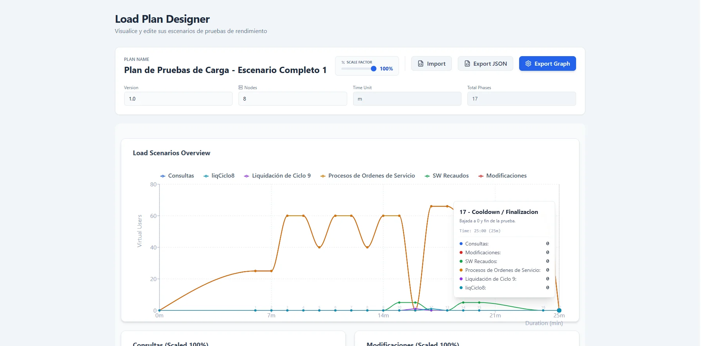

# Load Plan Visualizer

A modern React application for designing and visualizing load plans with interactive charts, drag-and-drop functionality, and export capabilities.




## Features

- 📊 Interactive load plan visualization
- 📈 Dynamic charts with Recharts
- 🎨 Modern UI with Tailwind CSS
- 📱 Responsive design
- 💾 JSON import/export functionality
- 🖼️ Image export capabilities
- 🐳 Docker support with Bun runtime
- ⚡ Fast build with Vite

## Tech Stack

- **Frontend:** React 19, TypeScript, Tailwind CSS
- **Charts:** Recharts
- **Build Tool:** Vite
- **Runtime:** Bun (optimized for Docker)
- **Export:** html-to-image
- **Icons:** Lucide React

## Run Locally

**Prerequisites:**  Node.js or Bun runtime

### Using Bun (Recommended)
1. Install dependencies:
   `bun install`
2. Run the app:
   `bun run dev`

### Using npm/yarn
1. Install dependencies:
   `npm install`
2. Run the app:
   `npm run dev`

## Docker

### Local Build & Run

1. Build the image:
   `docker build -t load-plan-visualizer .`
2. Run the container:
   `docker run -p 3000:3000 load-plan-visualizer`

### Multi-platform Build & Push to Registry

```bash
docker buildx build `
  --platform linux/amd64,linux/arm64 `
  --tag danielrondongarcia/load-plan-visualizer:latest `
  --tag danielrondongarcia/load-plan-visualizer:v1.0.0 `
  --push `
  .
```

### Pull and Run from Registry

```bash
# From Docker Hub
docker run -p 3000:3000 danielrondongarcia/load-plan-visualizer:latest

# From GitHub Container Registry
docker run -p 3000:3000 ghcr.io/danielrondongarcia/load-plan-visualizer:latest
```

## Docker Compose

### Using Docker Hub Image

Create a `docker-compose.yml` file and run:

```bash
docker-compose up -d
```

Or use the provided compose file:

```bash
docker-compose -f docker-compose.yml up -d
```

### Using GitHub Container Registry Image

Use the GitHub Container Registry variant:

```bash
docker-compose -f docker-compose.ghcr.yml up -d
```

### Docker Compose Commands

```bash
# Start the application
docker-compose up -d

# View logs
docker-compose logs -f

# Stop the application
docker-compose down

# Restart the application
docker-compose restart

# Update to latest image
docker-compose pull && docker-compose up -d
```

### Docker Compose Files Available

- `docker-compose.yml` - Basic setup with Docker Hub image
- `docker-compose.ghcr.yml` - Basic setup with GitHub Container Registry image
- `docker-compose.advanced.yml` - Advanced setup with Traefik labels and optional features

### Environment Variables

You can customize the deployment using environment variables:

```bash
# Create a .env file
cat > .env << EOF
NODE_ENV=production
PORT=3000
EOF

# Run with environment variables
docker-compose --env-file .env up -d
```